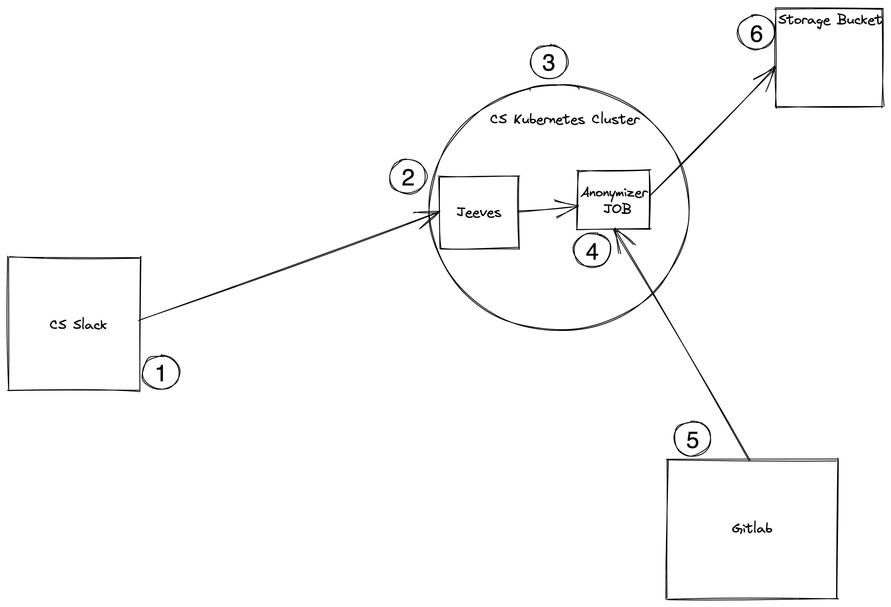

# Architecture

Jeeves is an event driven slack bot, the architecture is pretty simple

1. A user in slack uses a [slash command][1] giving the id of a candidate and
   the url of the candidates submission

2. Slack sends a payload to jeeves' endpoint that contains the id of the
   candidate and the url of the submission, this information is then used to
   create a Kubernetes Job that runs the anonymization script

3. Jeeves currently runs in the shared CS kubernetes cluster with a test
   instance and a production ready instance

4. The anonymization Job Kicks by taking in three arguments, the kind of repo
   (gitlab.com, github.com) the path to the submission (test-user/API-Excercise)
   and the id of the candidate (CNC0001). The container used in the job is
   setup to use the CS test gitlab user or Github users SSH keys

5. Gitlab (or Github) is where the candidate submits their API excercise. The
   Job kicked off uses an ssh key to clone the repo, therfore the candidate
   must give the CS user permissions to clone the repo

6. Finally once the Anonymization job has been finished, the final code is
   zipped up and pushed to a google storage bucket. The recruiters can then
   find it their using the id provided

[1]: https://api.slack.com/interactivity/slash-commands

